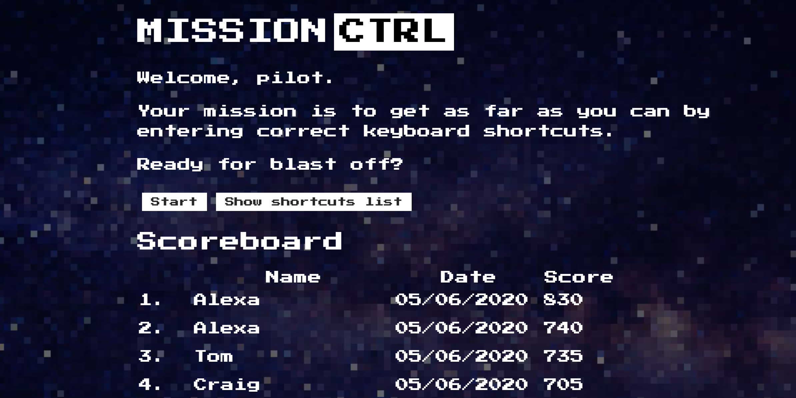

## Graham Falconer
I am a British South-African, Full Stack Developer and graduate of the Makers Academy Bootcamp in London. During my time at Makers, I enjoyed an incredible shift in the the spectrum of what of what I thought I was capable of and have become more passionate about problem solving then ever before. I am currently looking for a job as a Junior Developer so that I can build on the skills, learn new things and to help make valid contribution to a company's success. 

I am looking for a company which has a great culture and is excited about their vision so that I can can help them as they help me on our journeys. My main interests in tech at the moment are machine learning, data science and AI. 

## Projects
| Project Name | Project Picture | Project Description | Project link |
|--------------|-----------------|------------------------------|----------|
| Gapagbook | | A mock of facebook with user sign-up/sign-in and posts | https://gapag1.herokuapp.com |
| Mission-ctrl |  | A game to learn VScode shortcuts using Javascript event listeners | http://mission-ctrl.surge.sh |

## Skills

**Problem-solver** -Tech is providing me with an awesome scope of challenges, each allowing me to utilise a subset of problem-solving skills I have such as my curiosity, determination and idea-formulation. This was present in my Makers challenges as I actively came up with new ways to debug the problem and provided innovative solutions of my own that would help us move forward.

**Good communicator** - I have always been recognised as an optimistic and outgoing person by my peers and have regularly been put forward for roles involving demonstrations, negotiations and public-speaking. This has allowed me to become a great story-teller who can help motivate and inspire with my words.

**Flexibility** - This is arguably the skill I resonate with the most, having lived in 6 different countries by the age of 22 (New Zealand, South Africa, Kuwait, Bahrain, England & Scotland) I am no stranger to change and the difficulties that come with it. I have always been able to quickly establish and integrate myself into new cultures. This was present during my move from school in Cape Town to Sutton Valence where in my 2 years I became an active member in multiple sports teams and other societies where I was be able to represent the school.

**Enthusiastic** - Tech has been an exciting whirlwind for me thus far and I have found enthusiasm to be my enabler in the work I do and believe in sharing that enthusiasm with the team for best results. This was present during my work on the final project at Makers where I regularly made sure everyone focussed on the wonder and the challenge aspect of what we were doing so that people felt energised going into their tasks. 

**Culture Oriented** - public space, geography, study of culture, talked about culture
Public speaker - could go into good communicator but I have a lot on it.

___________________________________________

## My time at Makers Academy

During my time at Makers I worked with the following technologies
 
| Purpose                      | Technology         |
| ---------------------------- | :----------------- |
| Front end framework          | React              |
| Server framework             | Express            |
| ORM                          | Mongoose           |
| Language                     | Javascript, Ruby   |
| CI/CD                        | Travis             |
| Hosting                      | Heroku, Surge      |
| Databases                    | MongoDB, PostgreSQL |
| Styling                      | Sass, CSS, Bulma  |
| Testing frameworks       | Mocha, Chai, Sinon, Rspec, Jest, Enzyme, Jasmine, WilsonScript(my own), Capybara |
| Codequality   | Rubocop, SimpleCov, Rubycritic |
| Encryption    | Bcrypt     |

- One of the skills I am most happy to have developed during my time at makers was my ability to follow extreme programming principles, I am better able to see the value in 

- communication and checking in with my partner
- simplicity - I learned not to overcomplicated problems and following the process of completing the next simplest step that moves me towards my MVP

- Feedback - I learned both the value of giving and receiving feedback and how crucial it is to ensure that transparecy and giving appropriate validation or constructive criticism

- Courage - the importance of being able to speak up when something is right or when you are not on the same page / don't understand something

- Respect - respecting what my peers are saying as everyones opinion is valid and essential in decision making processes, knowin when it is your chance to speak and not speaking over another person who is currently speaking

## Education

**University of Birmingham - Geography (BA) 2016-2019**

During my time at the University of Birmingham I achieved a 2:1 and developed skills in:
  - Data collection & sampling
  - Data Analysis
  - Data manipulation and presentation
  
___________________________________________
**Sutton Valence School - (A-levels)Geography, Business, Economics - 2014-2016**

During my time at Sutton Valence school:
  - I Developed skills in public speaking and entrepreneurship
  - Won the Rotary Youth Speaks public speaking award for SVS (2015)
  - Contributed towards a positive school environment by arranging after school socials for boarders
  - Captained the school swimming team in multiple galas

___________________________________________
**International School of Cape Town - (GCSE's) 2010-1016**

During mt time at the International School of Cape Town:
  - I did weekly charity work in the township of Masiphumelele where I was able to work with children who live in extreme circumstances and educate them on the values of community, respect and togetherness.
  - Trained as a lifeguard on Camps Bay Beach where I learned emergency protocols and how to stay vigilient in busy times 

## Experience

**Makers Academy** (February 2020 - June 2020)    

*Junior Developer*  
- AGILE processes
- Understandings of O.O.D
- T.D.D
- Ruby & Javascript  

**Minutz Management (Work experience)** 

*Work Experience*  
- Got to work side by side with developers in preparing a product for our client
- Created presentations for clients

**Scientrix (Work experience)** 

*Work Experience*  
- Developed models using the Scientrix business matrix strategy tool,
- Learned about business tools for productivity and agile working

## Hobbies

I am massively passionate about animals and given the opportunity I like to go out into nature and see what I can find, this leads to a lot of travel exploration.
