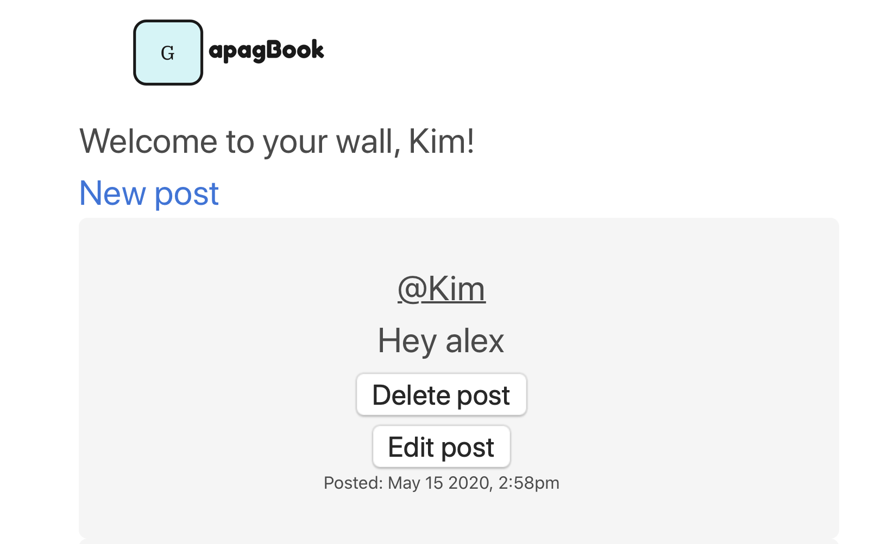

<h1 text-align: center;> Graham Falconer </h1>

I am a British South-African, Full Stack Developer and graduate of the Makers Academy Bootcamp in London. During my time at Makers, I enjoyed an incredible shift in the the spectrum of what of what I thought I was capable of and have become more passionate about problem solving then ever before. I am currently looking for a job as a Junior Developer so that I can build on the skills, learn new things and to help make valid contribution to a company's success. 

I am looking for a company which has a great culture and is excited about their vision so that I can can help them as they help me on our journeys. My main interests in tech at the moment are machine learning, data science and AI. 

## Projects
| Project Name | Project Picture | Project Description | Project link |
|--------------|-----------------|------------------------------|----------|
| Gapagbook | | A mock of facebook with user sign-up/sign-in and posts | https://gapag1.herokuapp.com |
| Mission-ctrl |  | A game to learn VScode shortcuts using Javascript event listeners | http://mission-ctrl.surge.sh |

## Technologies

|**Programming**|
|--------------------------------|
| Ruby, Sinatra, Ruby on Rails, Javascript, Node.js, JQuery, HTML, CSS, React, Express, PostgreSQL, SQLite, MongoDB, Travis CI/CD, Rspec, Rubocop, SimpleCov, Rubycritic, Capybara, Mocha, Chai, Jest, Enzyme, Jasmine   |
|**other technologies...**|
|Miro, Trello (Agile workflow tool), ArcGIS, ArcMaps, Microsoft Word, Microsoft Excel, Microsoft Powerpoint, Adobe Photoshop.|

## Skills

**Problem-solver** - Tech is providing me with an awesome scope of challenges, each one allowing me to utilize a subset of problem-solving skills, such as my curiosity, determination, and idea-formulation. This was present in my Maker's challenges as I actively came up with new ways to debug the problem and provided innovative solutions of my own that would help us move forward.
_____________________________

**Good communicator** - I have always been recognized as an optimistic and outgoing person by my peers and have regularly been put forward for roles involving demonstrations, negotiations, and public speaking. This has allowed me to become a great story-teller who can help motivate and inspire with my words.

_____________________________

**Flexibility** - This is arguably the skill I resonate with the most, having lived in 6 different countries by the age of 22 (New Zealand, South Africa, Kuwait, Bahrain, England & Scotland) I am no stranger to change and the difficulties that come with it. I have always been quick to establish and integrate myself into new cultures. This was present during my move from school in Cape Town to Sutton Valence, wherein my 2 years I became an active member in multiple sports teams and other societies where I was able to represent my school.

_____________________________

**Enthusiastic** - Tech has been an exciting whirlwind for me thus far and I have found enthusiasm to be my enabler in the work I do and believe in sharing that enthusiasm with the team for best results. This was present during my work on the final project at Makers where I regularly made sure everyone focussed on the wonder and the challenge aspect of what we were doing so that people felt energized going into their tasks.

_____________________________

**Culture Oriented** - public space, geography, study of culture, talked about culture
Public speaker - could go into good communicator but I have a lot on it.

## Education

**University of Birmingham - Geography (BA) 2016-2019**
During my time at University I developed skills in;
  - Statistical tracking
  - Data collection & sampling
  - Data Analysis
  - Data manipulation and presentation
  - Mapping
  
  
___________________________________________
**Sutton Valence School - 2014-2016**

During my time at Sutton Valence school:
  - I Developed skills in public speaking and entrepreneurship
  - Won the Rotary Youth Speaks public speaking award for SVS (2015)
  - Contributed towards a positive school environment by arranging after school socials for boarders
  - Captained the school swimming team in multiple galas

 **(A-levels)**
 
Geography - A*
Business - A 
Economics - B

___________________________________________
**International School of Cape Town - (GCSE's) 2010-1016**

During mt time at the International School of Cape Town:
  - I did weekly charity work in the township of Masiphumelele where I was able to work with children who live in extreme circumstances and educate them on the values of community, respect and togetherness.
- Played in the schools first futsal team
  - Trained as a lifeguard on Camps Bay Beach where I learned emergency protocols and how to stay vigilient in busy times 

## Experience

**Makers Academy** (February 2020 - June 2020)    

*Junior Developer*  

During my time on the course I got to practise some fundamental programming processes such as; 

 *T.D.D : I would write tests for the code that I wrote. This allowed me to be able to solve complex problems through a methodical process as well as stay organised and ontop of task at hand.

*Agile Workflow : Events such as standups, scrums and check-ins were used regularly. This is to follow modern methodologies on how we should programme and to help to abide by the Extreme Programming Principles; feedback, respect, courage, communication and simplicity.

As well as build on the foundation of understanding I had of O.D.D, the MVC and how my code should all fit and work together. 

_____________________________

**Minutz Management (Work experience)** 

*Work Experience*  
- Got to work side by side with developers in preparing a product for our client
- Created presentations for clients

_____________________________

**Scientrix (Work experience)** 

*Work Experience*  
- Developed models using the Scientrix business matrix strategy tool,
- Learned about business tools for productivity and agile working

- Coding... was encouraged to learn some basic coding principles by developers within the company as I discovered a passion an initial for it.

## Hobbies

I love travel, nature, hiking and the occassional braai.
